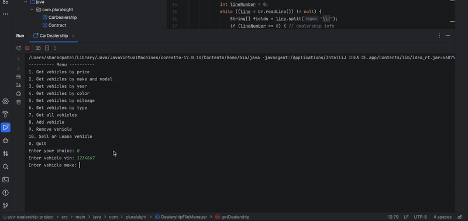

# Advance Car Dealership

## Description of the Project

This project enhances a dealership management system by adding Sales and Leasing functionality.
A new menu option, SELL/LEASE A VEHICLE, allows users to record vehicle sales or leases. 
Users will provide customer and vehicle information, specify whether the transaction is a sale or lease (with leases restricted to vehicles less than 3 years old), and pricing will be calculated accordingly.
## User Stories

- As a user, I want to select an option to sell or lease a vehicle from the main menu so that I can record vehicle transactions.
- As a user, I want to input customer and vehicle details, specify sale or lease, and ensure leasing is only allowed for vehicles less than 3 years old.
- As a user, I want the system to calculate total price and monthly payments based on whether it is a sale or lease, including fees, taxes, and financing terms.
- As a user, I want all sales and lease contracts to be saved by appending them to a contracts file so that the data is stored reliably and can support multiple dealerships.

## Setup

1. Clone the Repository
    1. git clone https://github.com/sharad101/CarDealership.git
    2. cd adv-dealership-project

2. Open/Launch in IntelliJ IDEA
   Launch IntelliJ IDEA
    1. Click File > Open
    2. Select the project folder you just cloned

3. Configure Project
    1. Go to File > Project Structure

4. Build and Run the Project
    1. Open the main class file (CarDealership.java)
    2. Right-click on it and select Run 'CarDealership.main()'

### Prerequisites

- IntelliJ IDEA: Ensure you have IntelliJ IDEA installed, which you can download from [here](https://www.jetbrains.com/idea/download/).
- Java SDK: Make sure Java SDK is installed and configured in IntelliJ.

### Running the Application in IntelliJ

Follow these steps to get your application running within IntelliJ IDEA:

1. Open IntelliJ IDEA.
2. Select "Open" and navigate to the directory where you cloned or downloaded the project.
3. After the project opens, wait for IntelliJ to index the files and set up the project.
4. Find the main class with the `public static void main(String[] args)` method.
5. Right-click on the file and select 'Run 'YourMainClassName.main()'' to start the application.

## Technologies Used

- Java 17

## Demo

!

## Interesting Code

      public void processSellOrLeaseVehicle() {
        System.out.print("Enter the VIN of the vehicle to sell or lease: ");
        int vin = scanner.nextInt();
        scanner.nextLine();

        Vehicle selectedVehicle = null;
        for (Vehicle v : dealership.getAllVehicles()) {
            if (v.getVin() == vin) {
                selectedVehicle = v;
                break;
            }
        }

        if (selectedVehicle == null) {
            System.out.println("Vehicle not found.");
            return;
        }

        System.out.print("Enter customer name: ");
        String name = scanner.nextLine();
        System.out.print("Enter customer email: ");
        String email = scanner.nextLine();

        System.out.print("Is this a sale or lease? (Enter 'sale' or 'lease'): ");
        String contractType = scanner.nextLine();

        Contract contract;
        if (contractType.equalsIgnoreCase("sale")) {
            System.out.print("Is this a financed purchase? (true/false): ");
            boolean finance = Boolean.parseBoolean(scanner.nextLine());
            contract = new SalesContract(LocalDate.now().toString(), name, email, selectedVehicle, finance);
        } else if (contractType.equalsIgnoreCase("lease")) {
            System.out.print("Enter expected ending value: ");
            double expectedEndingValue = Double.parseDouble(scanner.nextLine());
            System.out.print("Enter lease fee: ");
            double leaseFee = Double.parseDouble(scanner.nextLine());
            contract = new LeaseContract(LocalDate.now().toString(), name, email, selectedVehicle, expectedEndingValue, leaseFee);
        } else {
            System.out.println("Invalid contract type.");
            return;
        }

        ContractFileManager cfm = new ContractFileManager();
        cfm.saveContract(contract);
        dealership.removeVehicle(selectedVehicle);
        DealershipFileManager manager = new DealershipFileManager();
        manager.saveDealership(dealership);

        System.out.println("Contract saved and vehicle removed from inventory.");
    }

This code is interesting because it neatly integrates several key concepts of a dealership sales/leasing system into a single user-driven workflow with clear logical steps:

- User Interaction & Validation:
It prompts the user for input like VIN, customer details, and contract type, then validates if the vehicle exists in inventory. This shows real-time input handling and basic validation, crucial for any interactive system.

- Dynamic Contract Creation Using Polymorphism:
Depending on the contract type ("sale" or "lease"), it dynamically creates an instance of either SalesContract or LeaseContract. This leverages polymorphism and abstract classes/interfaces, allowing flexible extension for contract types.
## Resources

List resources such as tutorials, articles, or documentation that helped you during the project.

- Raymond's Notes
- Potato Sensei

## Thanks

Express gratitude towards those who provided help, guidance, or resources:

- Thank you to Raymond for continuous support and guidance.

 